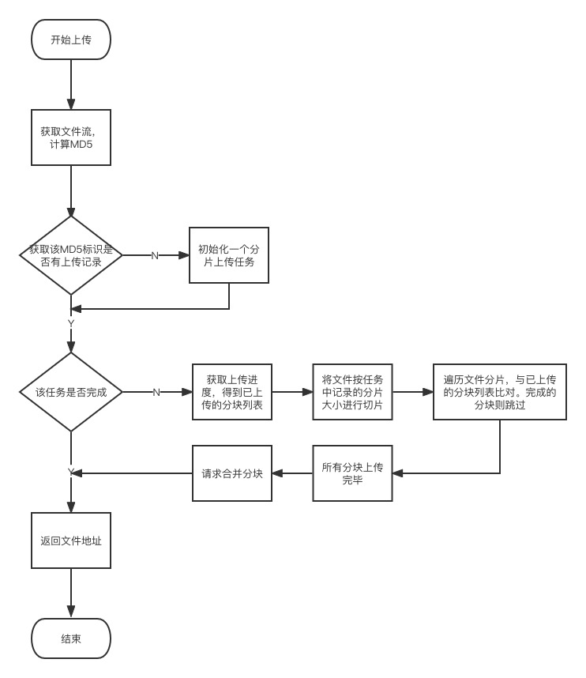

# 分片文件上传逻辑

> 原作者：@Gary2016
>
> 原仓库：https://gitee.com/Gary2016/minio-upload

`完整示例调用：`----> https://github.com/qianzhikang/minio-multipart-upload/blob/main/src/main/resources/static/html/index.html

## 流程图



## 接口调用顺序说明
### 第一步：计算文件md5值，通过md5值获取文件上传的记录

> 1. 获取上传记录信息 `http://localhost:8080/v1/minio/tasks/${identifier}`，其中`identifier`为计算出来的文件`md5唯一标号`
> 
>
> **下文将要使用到的参数说明：**
>
> - `finished:`是否已经上传完毕
>- `path:`访问链接
> - `taskRecord：`上传记录信息
>  - `chunkNum：`总切片数
>   - `chunkSize:` 切片数量
>  - `exitPartList:`已经存在的切片
>     - `partNumber:` 分片编号
> 

### 第二步：若接口返回第一步接口返回数据为null，则创建一个分片请求任务

> 2. POST请求创建分片请求任务 `http://localhost:8080/v1/minio/tasks`
>
> **请求参数：**
>
> ```js
> const initTaskData = {
>           identifier：identifier,   		// 文件唯一md5标识
>           fileName: uploadFile.name, 	//  文件名称
>           totalSize: uploadFile.size,	//  文件总大小
>           chunkSize: 5 * 1024 * 1024, //  文件分片大小
>         };
> ```
>
> **该接口的返回值和第一步返回值类型相同！**

### 第三步：将文件切片，按分片标记获取各个分片的上传url

> 3. GET请求`http://localhost:8080/v1/minio/tasks/${identifier}/${partNumber}`
>
> **请求参数：**
>
> `identifier:`文件唯一md5标识
>
> `partNumber:`文件分片标识（示例：1）
>
> **该接口的data将返回上传的url！**

### 第四步：根据第三步中获取的上传的URL，使用PUT请求上传分片文件

> 4. PUT请求`第三步中获取的url`上传切片文件

**注：第三第四步为循环执行，分几片将执行多少次，执行一次流程为上传单片文件！**


### 第五步：当循环完成上传完全部切片后，合并文件

> 5. POST请求`http://localhost:8080/v1/minio/tasks/merge/${identifier}`
>
> **请求参数：**
>
> `identifier`：文件唯一md5标识

